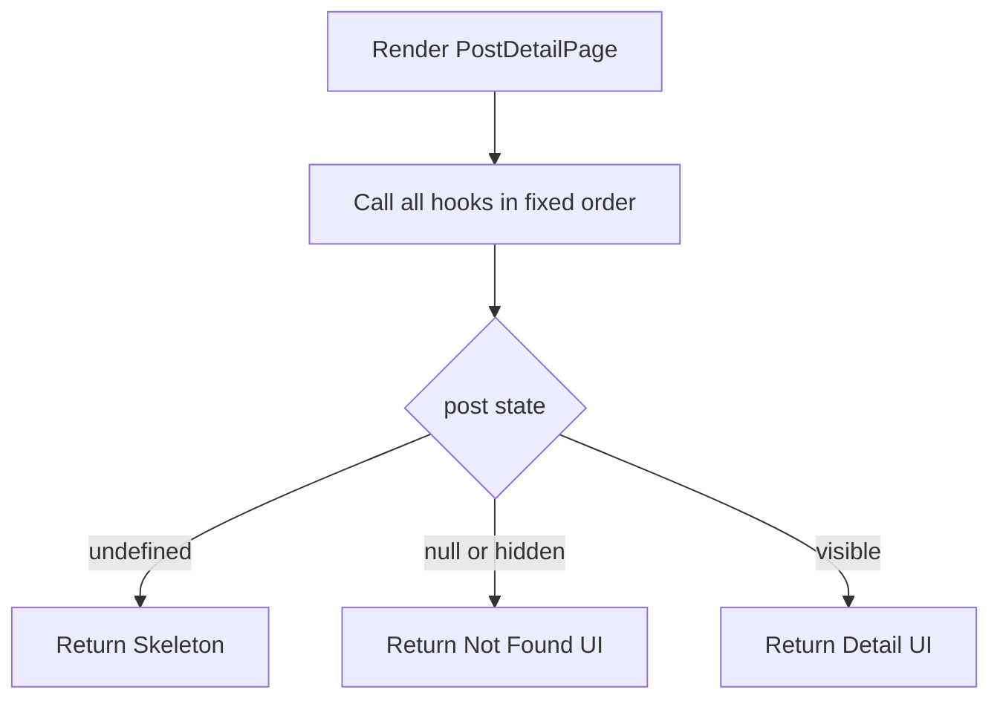

# I. Primer
## 1. TL;DR kiểu Feynman
- Lỗi web hiện tại là **vi phạm thứ tự Hooks (Rules of Hooks)** trong `PostDetailPage`.
- Cụ thể: component có **early return** trước một `useMemo`, làm số hook giữa 2 lần render bị lệch.
- Kết quả là runtime báo: `Rendered more hooks than during the previous render`.
- Fix nhỏ nhất, an toàn nhất: **đảm bảo mọi hook luôn được gọi trước các nhánh `return` có điều kiện**.
- Audit toàn repo: chỉ thấy **1 case chắc chắn gây lỗi** (file post detail), một vài chỗ khác là pattern gần giống nhưng hiện chưa vi phạm trực tiếp.

## 2. Elaboration & Self-Explanation
- React yêu cầu hook phải được gọi theo cùng thứ tự ở mọi lần render.
- Trong `app/(site)/posts/[slug]/page.tsx`, sau khi gọi nhiều hook, component có nhánh:
  - `if (post === null || (!isVisiblePost && post)) return ...`
- Nhưng `categorySlugMap = useMemo(...)` lại nằm **sau** nhánh return này.
- Khi dữ liệu `post` thay đổi trạng thái giữa các lần render (ví dụ trước có post hợp lệ, sau thành null/hidden), lần render sau sẽ thoát sớm và **không gọi** `useMemo(categorySlugMap)`, dẫn đến mismatch thứ tự hook.
- Vì vậy đây là bug logic hooks, không phải do Turbopack hay Next.js version.

## 3. Concrete Examples & Analogies
- Ví dụ cụ thể trong repo:
  - Render A (post hợp lệ): gọi tới `useMemo(categorySlugMap)`.
  - Render B (post null/không visible): return sớm trước dòng đó.
  - => React thấy số hook không khớp giữa A và B, ném lỗi.
- Analogy đời thường: như checklist 10 bước kiểm tra máy bay; chuyến trước làm đủ 10 bước, chuyến sau bỏ qua bước 10 vì rẽ nhánh sớm — hệ thống an toàn coi đó là trạng thái không hợp lệ.

# II. Audit Summary (Tóm tắt kiểm tra)
- Observation:
  - Error trace trỏ đúng `PostDetailPage` line chứa `categorySlugMap = useMemo(...)`.
  - Trong file có early return xuất hiện trước hook này.
- Inference:
  - Đây là nguyên nhân trực tiếp của lỗi hook-order mismatch.
- Decision:
  - Chốt fix theo hướng tối thiểu: di chuyển/khởi tạo `categorySlugMap` trước mọi early return, giữ nguyên behavior UI.

- Kết quả audit tương tự (repo-wide, mức độ tin cậy):
  - **High (bug thật):** `app/(site)/posts/[slug]/page.tsx` (`PostDetailPage`).
  - **Medium (pattern dễ tái phạm, hiện chưa lỗi hooks):** `components/site/QuickContact.tsx` (`QuickContactButtons`, `QuickContactCompact`) có early return theo data/prop nhưng chưa có hook phía sau.
  - **Low (an toàn hiện tại):** một số file có early return sau khi đã gọi toàn bộ hooks, không có hook mới phía sau.

# III. Root Cause & Counter-Hypothesis (Nguyên nhân gốc & Giả thuyết đối chứng)
- Root cause (High confidence):
  1) Triệu chứng: lỗi runtime hook-order, expected là render bình thường.
  2) Phạm vi: trang chi tiết post (bao gồm route unified trỏ về component này).
  3) Tái hiện: ổn định khi trạng thái `post` chuyển qua lại giữa visible/non-visible.
  4) Mốc thay đổi gần nhất: chưa cần xác định commit để kết luận vì evidence tại code path hiện hữu đã đủ trực tiếp.
  5) Dữ liệu thiếu: không thiếu cho chẩn đoán nguyên nhân gốc.
  6) Giả thuyết thay thế: lỗi do child component/hooks khác → đã loại trừ vì stack và vị trí mismatch trùng `PostDetailPage` line 210.
  7) Rủi ro nếu fix sai: lỗi runtime tiếp diễn, có thể crash trang detail.
  8) Pass/fail: không còn cảnh báo “change in order of hooks” và không còn “Rendered more hooks...”.

- Counter-hypothesis:
  - “Có thể do `UnifiedDetailPage` import trực tiếp page khác gây lỗi.”
  - Đánh giá: **Low**. `UnifiedDetailPage` chỉ điều hướng render component; mismatch xảy ra bên trong `PostDetailPage` do nhánh return + hook placement.

# IV. Proposal (Đề xuất)
- Đề xuất chính (khuyến nghị):
  1. Trong `PostDetailPage`, đưa `categorySlugMap` (và mọi hook khác nếu có tương tự) lên khu vực trước các nhánh `if (post === undefined)`, `if (post === null || ...)`.
  2. Đảm bảo không có hook mới nào nằm sau early return có điều kiện.
  3. Giữ nguyên output hiện tại (skeleton/not-found/content) để không mở rộng scope.

- Guardrail áp dụng để tránh tái phạm:
  - Quy tắc nội bộ cho file này: “Hook section” đặt liền nhau ở đầu component; logic return có điều kiện đặt sau hook section.

# V. Files Impacted (Tệp bị ảnh hưởng)
- **Sửa:** `app/(site)/posts/[slug]/page.tsx`
  - Vai trò hiện tại: client page render chi tiết bài viết + comments + related posts.
  - Thay đổi dự kiến: sắp xếp lại vị trí gọi hooks để không nằm sau early return.

- **Không sửa, chỉ audit cảnh báo pattern:**
  - `components/site/QuickContact.tsx`
  - Vai trò hiện tại: nút liên hệ nhanh.
  - Ghi chú: hiện chưa gây hook-order mismatch, nhưng có pattern early return cần cẩn trọng khi thêm hook mới trong tương lai.

# VI. Execution Preview (Xem trước thực thi)
1. Đọc lại khối hooks trong `PostDetailPage`.
2. Di chuyển `categorySlugMap` lên trước các nhánh return sớm.
3. Soát lại component để chắc chắn không còn hook nào sau early return.
4. Review tĩnh (typing/null-safety/không đổi behavior).
5. Chuẩn bị commit (không push) sau khi user duyệt spec.

# VII. Verification Plan (Kế hoạch kiểm chứng)
- Vì quy định repo: không chạy lint/unit test tự động.
- Verify tĩnh sẽ gồm:
  1. Đối chiếu thứ tự hooks trước/sau sửa trong `PostDetailPage`.
  2. Kiểm tra mọi nhánh return đều nằm sau hook section.
  3. Kiểm tra type inference không thay đổi (Map key/value đúng kiểu).
- Verify runtime do tester phụ trách:
  - Repro route `/posts/[slug]` và route unified tương ứng.
  - Quan sát console không còn 2 lỗi hooks nêu trên.

# VIII. Todo
- [ ] Refactor vị trí `categorySlugMap` hook trong `PostDetailPage`.
- [ ] Static self-review toàn component để loại trừ hook-after-return.
- [ ] Final audit note ngắn về các vị trí pattern tương tự (không sửa ngoài scope).
- [ ] Commit thay đổi (không push).

# IX. Acceptance Criteria (Tiêu chí chấp nhận)
- Không còn lỗi:
  - `React has detected a change in the order of Hooks called by PostDetailPage`
  - `Rendered more hooks than during the previous render`
- `PostDetailPage` giữ nguyên behavior hiển thị ở 3 trạng thái: loading / not-found / visible.
- Không phát sinh thay đổi ngoài file mục tiêu (trừ metadata commit nếu có).

# X. Risk / Rollback (Rủi ro / Hoàn tác)
- Rủi ro thấp: chủ yếu là reorder hook, không đổi business logic.
- Rủi ro tiềm ẩn: vô tình thay dependency/closure của hook khi di chuyển.
- Rollback: revert commit đơn lẻ nếu có regression.

# XI. Out of Scope (Ngoài phạm vi)
- Không refactor tổng thể kiến trúc `UnifiedDetailPage`.
- Không sửa hàng loạt các component khác trừ khi phát hiện bug hook-order thật sự.
- Không thay đổi UI/UX và không tối ưu hiệu năng ngoài lỗi hiện tại.